# S3 Gateway Web Admin: User Guide

This guide shows how to use the website day to day. Not installed yet? See [INSTALLATION.md](INSTALLATION.md).

> Screenshots come from a demo gateway with sample data (14 street-light nodes, gateway ID `GW-KL-0014`).

## Contents

1. [The golden rule: Save, then Apply](#1-the-golden-rule-save-then-apply)
2. [Log in](#2-log-in)
3. [Overview](#3-overview)
4. [Devices](#4-devices)
5. [Settings](#5-settings)
6. [Logs](#6-logs)
7. [Serial](#7-serial)
8. [Apply your changes](#8-apply-your-changes)
9. [Using a phone](#9-using-a-phone)
10. [Backups and undoing a mistake](#10-backups-and-undoing-a-mistake)
11. [Messages you may see](#11-messages-you-may-see)

---

## 1. The golden rule: Save, then Apply

Changes happen in **two steps**, so a typo can never stop a running gateway by accident:

| Step | What it does | Effect on the gateway |
|---|---|---|
| **1. Save** (Add device, Save, Remove, Save settings...) | Writes your change to the operator files | **None.** The gateway keeps running as before. |
| **2. Apply changes** | Checks the files, backs up, updates the database and **restarts the gateway** | The gateway uses your changes. Polling stops for a short time while it restarts. |

You can make as many saves as you like, then apply once. A yellow bar at the bottom of the screen reminds you when there are saved changes that are not applied yet:

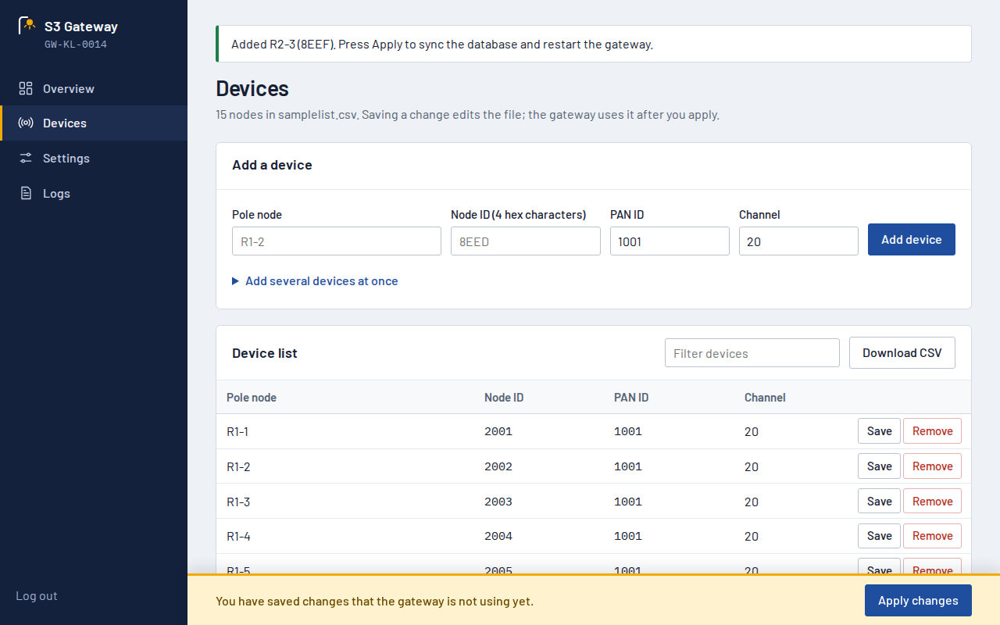

---

## 2. Log in

Open `http://<gateway-ip>:8080/` in your browser and enter the password chosen during installation.

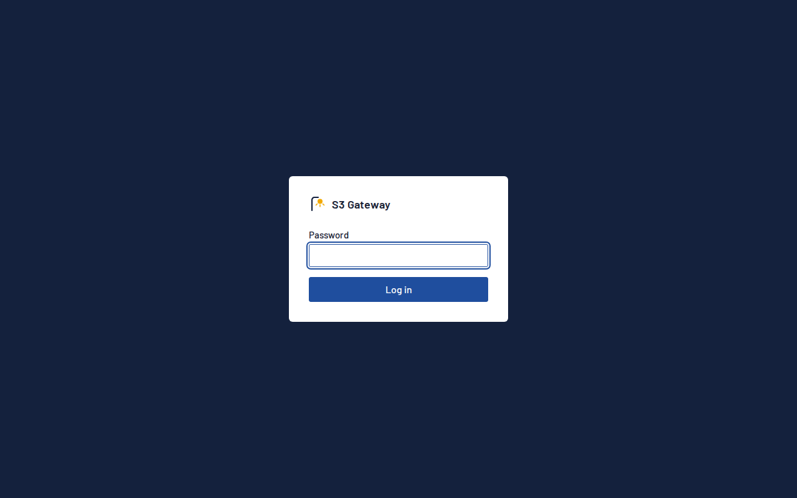

* After **5 wrong passwords** the login locks for 60 seconds.
* You stay logged in for up to 8 hours.
* Use **Log out** at the bottom of the left menu when you are finished.

---

## 3. Overview

The first page after login. It answers: *is the gateway running, and is it using my latest changes?*

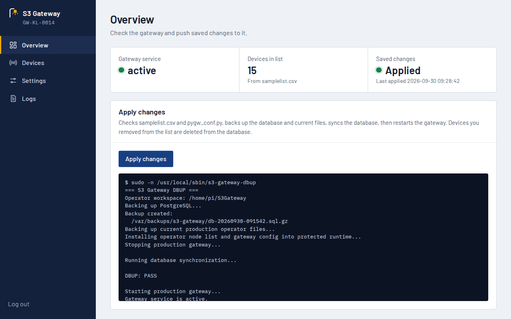

| Box | Meaning |
|---|---|
| **Gateway service** | Green `active` = the gateway is running. Red = it is stopped or failed. |
| **Devices in list** | Number of nodes in `samplelist.csv`. |
| **Saved changes** | `Applied` (green): the gateway is using everything you saved. `Not applied` (amber): you have saved changes waiting. `Unknown`: nothing has been applied from this website yet. |

The **Apply changes** panel runs the update and shows its live output (see [section 8](#8-apply-your-changes)).

When you have unapplied changes, the status turns amber:

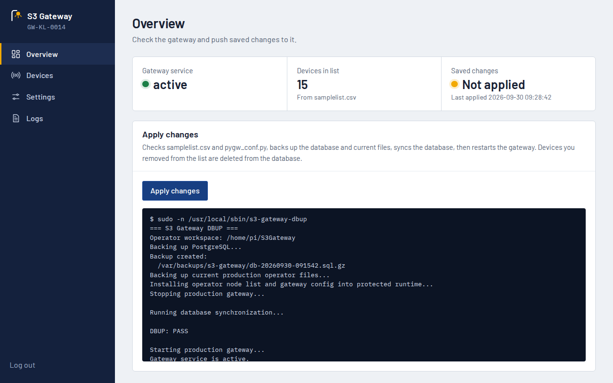

The left menu has five pages: **Overview**, **Devices**, **Serial**, **Settings** and **Logs**. The gateway ID is shown under the logo so you always know which site you are on.

---

## 4. Devices

The list of street-light nodes this gateway polls. It is the website's version of `samplelist.csv`.

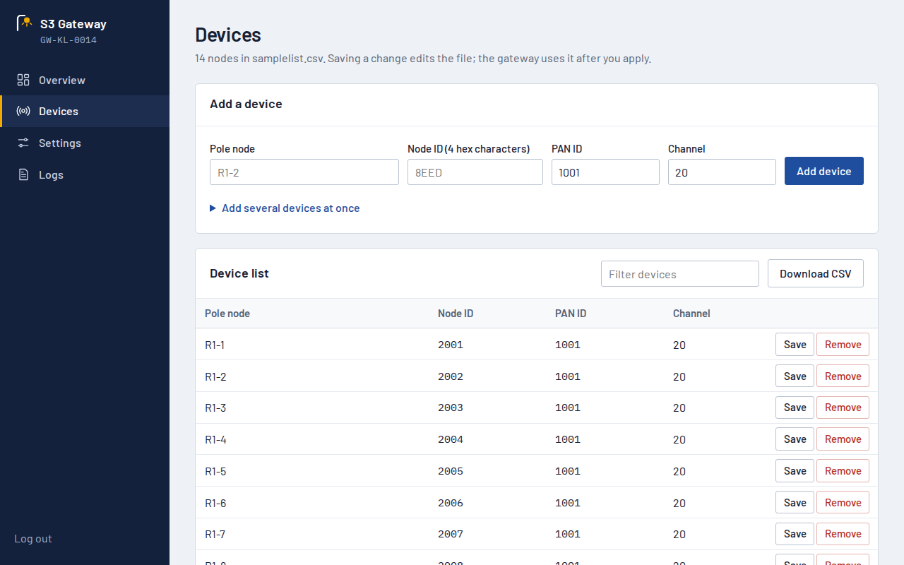

Each device has four fields:

| Field | Rules | Example |
|---|---|---|
| **Pole node** | Your pole label. Letters, digits, `.`, `_`, `-`; up to 32 characters. Must be unique. | `R1-2` |
| **Node ID** | Exactly 4 hex characters (`0-9`, `A-F`). Must be unique. Saved in capitals. | `8EED` |
| **PAN ID** | Hex, up to 4 characters. Pre-filled from the gateway's own PAN ID. | `1001` |
| **Channel** | Zigbee channel 11 to 26. Pre-filled from the gateway's own channel. | `20` |

### Add one device

1. Fill in **Pole node** and **Node ID** (PAN ID and channel are already filled in).
2. Click **Add device**.

A green message confirms it, and the yellow *Apply changes* bar appears:


If something is wrong, nothing is saved and a red message says why. For example, adding a node ID that already exists:

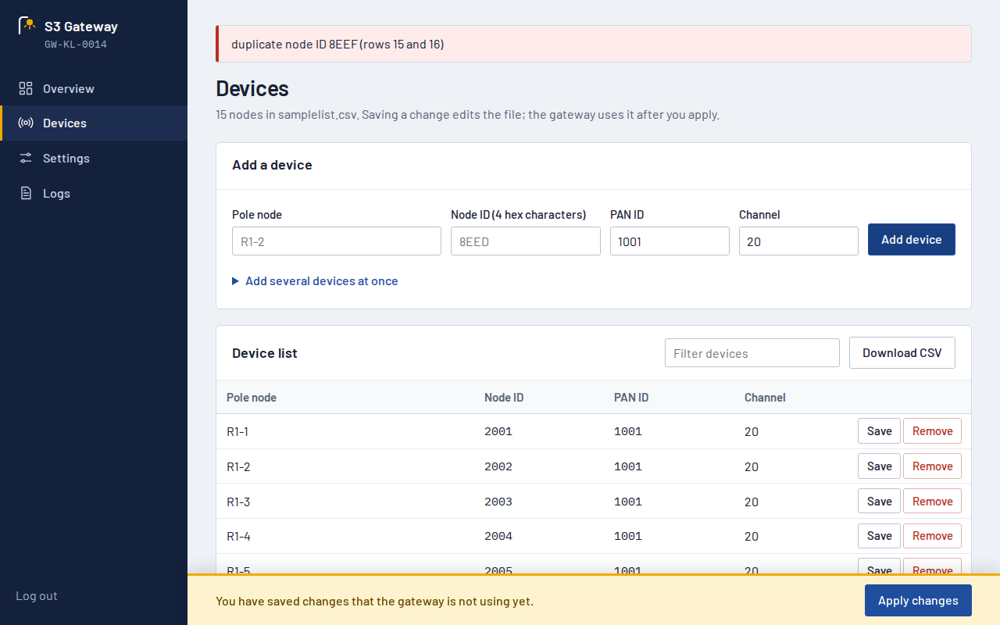

### Add several devices at once

1. Click **Add several devices at once**.
2. Type or paste **one device per line**, as `pole,node` or `pole,node,pan,channel`. Commas, tabs, spaces or semicolons all work. PAN ID and channel default to the gateway's values.
3. Click **Add devices**.

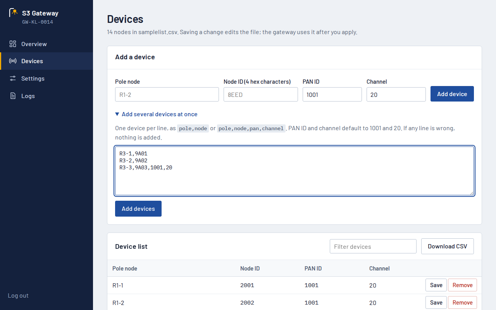

**All or nothing:** if any line is wrong, nothing is added and you are told which lines to fix. Blank lines and lines starting with `#` are ignored, and a pasted `pole_node` header line is skipped.

### Edit a device

Change any value directly in the table row, then click **Save** on that row. To rename a node ID, just edit it and save.

### Remove a device

Click **Remove** on the row and confirm. The device leaves the list immediately, but it is **deleted from the database only when you apply**.

> The list can never be empty: the gateway needs at least one node.

### Find a device

Type in the **Filter devices** box above the table. It matches any column (pole label, node ID, and so on).

### Download or replace the whole list

* **Download CSV** saves the current list as `samplelist.csv`, handy as your own backup or for editing in a spreadsheet.
* **Replace the whole list from a CSV file** (at the bottom of the page) uploads a file that **replaces every device**. The first line must be exactly `pole_node,node,pan_id,channel`. The old file is backed up first, and devices missing from the upload are removed when you apply. You are asked to confirm because this is a big change.

---

## 5. Settings

The gateway's configuration (`pygw_conf.py`) as a form. Every field is named after its exact variable name, so it matches what your engineers see in the file. Grey text under each field explains it.

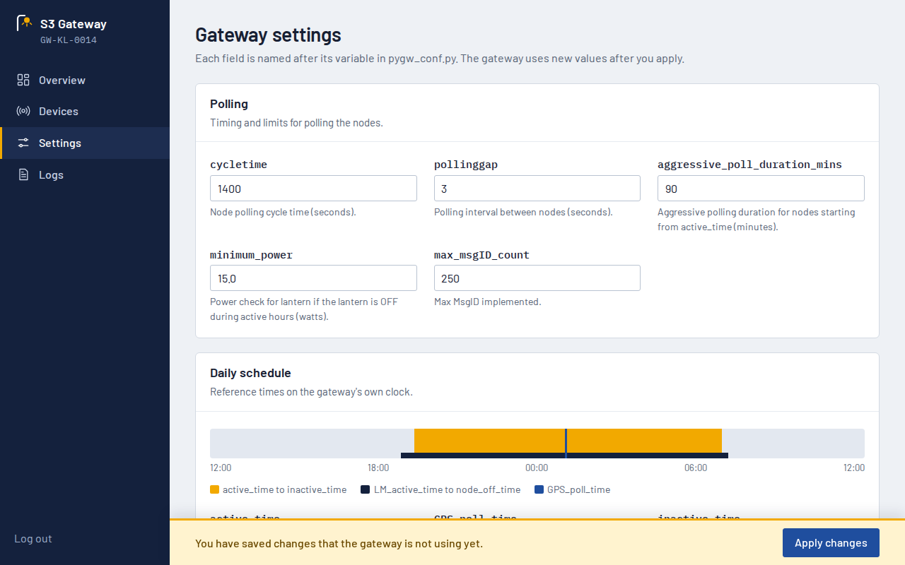

The fields are grouped:

| Group | Variables | What they control |
|---|---|---|
| **Polling** | `cycletime`, `pollinggap`, `aggressive_poll_duration_mins`, `minimum_power`, `max_msgID_count` | How often and how hard the nodes are polled |
| **Daily schedule** | `active_time`, `inactive_time`, `LM_active_time`, `node_off_time`, `GPS_poll_time` | Lantern ON/OFF reference times, manual-override window, GPS mapping start (24-hour time on the gateway's clock) |
| **HTTP and MQTT** | `test_align_flag`, `cert_codename`, `topic_header`, `client_ID`, `client_ID_2` | Upstream HTTP and MQTT behaviour |
| **Static gateway and database specs** | `localDBpath`, `first_GW_data`, `second_GW_data` | Node list file name; gateway node ID, PAN ID and channel |
| **PostgreSQL connection** | `db_host`, `db_port`, `db_user`, `db_password`, `db_name` | How the gateway reaches its database |

### The schedule bar

In *Daily schedule*, a 24-hour bar (noon to noon) redraws as you change the times, so an overnight window looks like one continuous block:

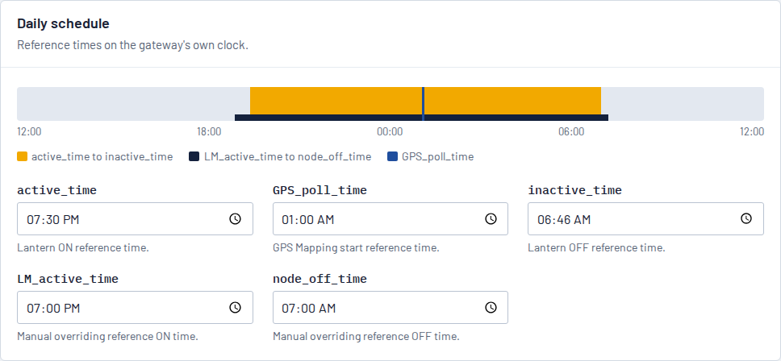

* **Amber** = lantern ON (`active_time` to `inactive_time`)
* **Dark navy** = manual-override window (`LM_active_time` to `node_off_time`)
* **Blue tick** = GPS mapping start (`GPS_poll_time`)

### Save your settings

Change what you need, then click **Save settings** at the bottom of the page.

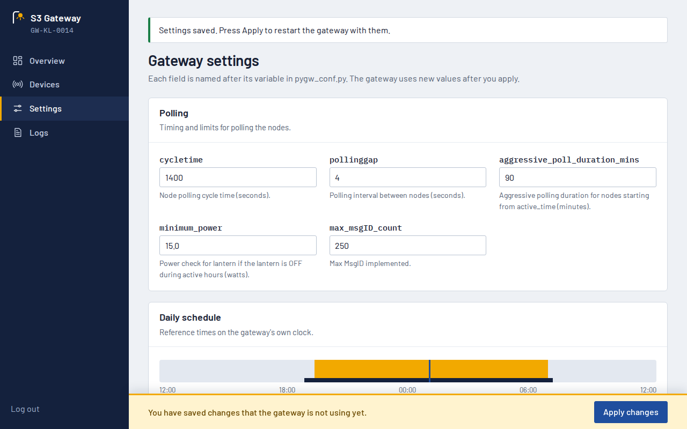

The gateway does not use the new values until you [apply](#8-apply-your-changes). The previous `pygw_conf.py` is backed up on every save.

### If a value is not allowed

Nothing is saved. The wrong field turns red and says what is expected:

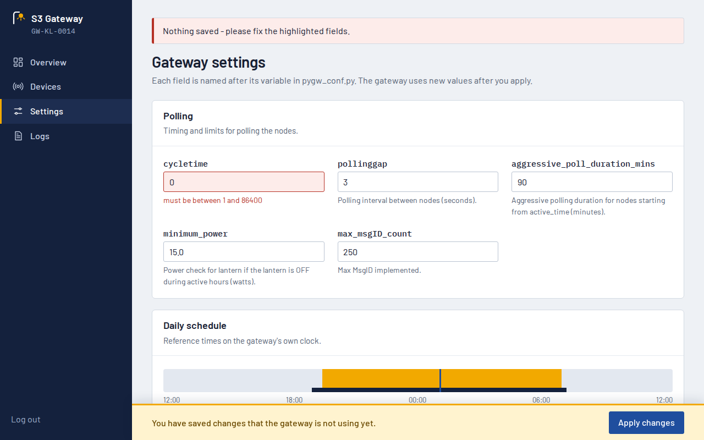

Fix the field and save again.

### Helpful warnings

* If `cycletime` is shorter than *number of devices × `pollinggap`*, a yellow notice tells you that polling will not finish a full cycle.
* After you save a change to `cert_codename`, `localDBpath` or any `db_*` value, you are reminded to check it carefully: a wrong value can stop the gateway from starting or reaching its database.

### Database settings and the password

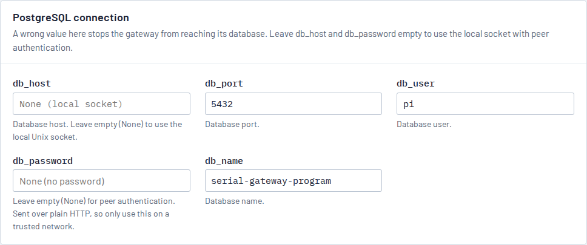

* Leave `db_host` **empty** to use the local socket (the normal setup on the gateway).
* The database password is **never shown**. Leave the box **blank** to keep the current one, type a new one to replace it, or tick **Remove the password** to clear it.
* The website uses plain HTTP, so only type a database password on a trusted network.

### Other variables (read-only)

At the bottom of the page, other variables in `pygw_conf.py` (log folders, message ID formats and so on) are listed for reference. They cannot be changed from the website.

---

## 6. Logs

A read-only view of what the gateway writes to disk. Use it to check that the gateway is healthy, without SSH.

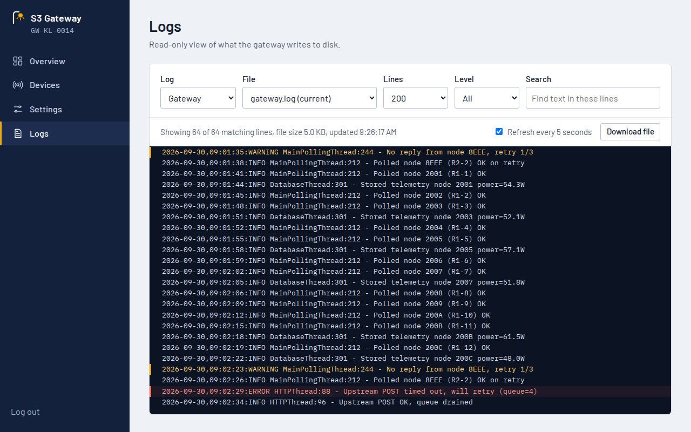

| Control | What it does |
|---|---|
| **Log** | Choose **Gateway**, **MQTT** or **Errors**. |
| **File** | The current file, or an older dated copy (for example `gateway.log.2026-09-29`). |
| **Lines** | How many of the newest lines to show (100 to 2000). |
| **Level** | Show only `ERROR`, `WARNING`, `INFO` or `DEBUG` lines. |
| **Search** | Show only lines containing your text (not case-sensitive). |
| **Refresh every 5 seconds** | Keeps the current log up to date. Untick it to stop the view moving while you read. |
| **Download file** | Saves the whole log file to your computer, useful to send to support. |

Lines are colour-coded by level. For example, filtering to **WARNING** to see which nodes are not replying:

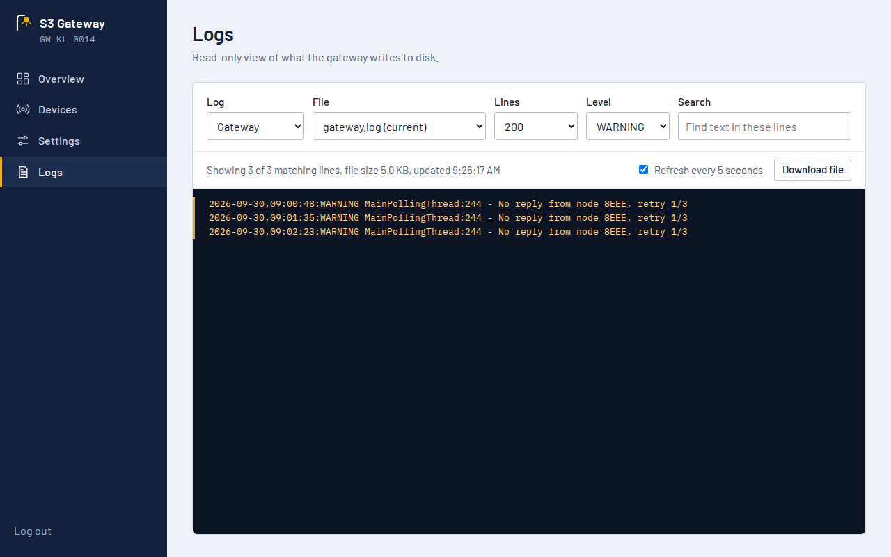

The line above the log tells you how many lines matched, the file size, and when the view last refreshed.

---

## 7. Serial

Use this page to send a command to one or more street lights straight away: check that a light answers, make it blink so you can find the pole, or switch it on and off. It does **not** use Save and Apply. Commands go out immediately.

It has two tabs. Most people only need **Node controls**.

### Node controls

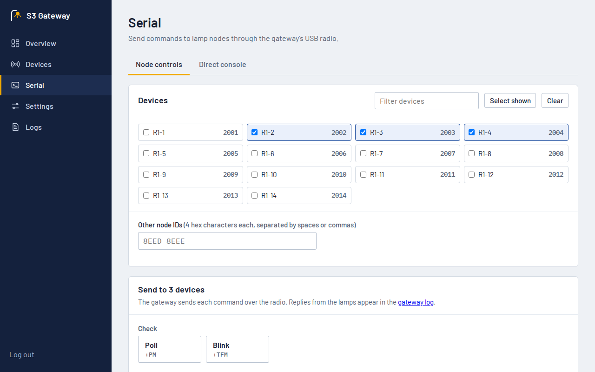

1. **Tick the lights** you want. Use **Filter devices** to find them, **Select shown** to tick everything the filter shows, and **Clear** to start again. A light that is not in your list can be typed into **Other node IDs** (4 characters, like `8EED`).
2. Check the heading says the right number: **Send to 3 devices**.
3. Press a button.

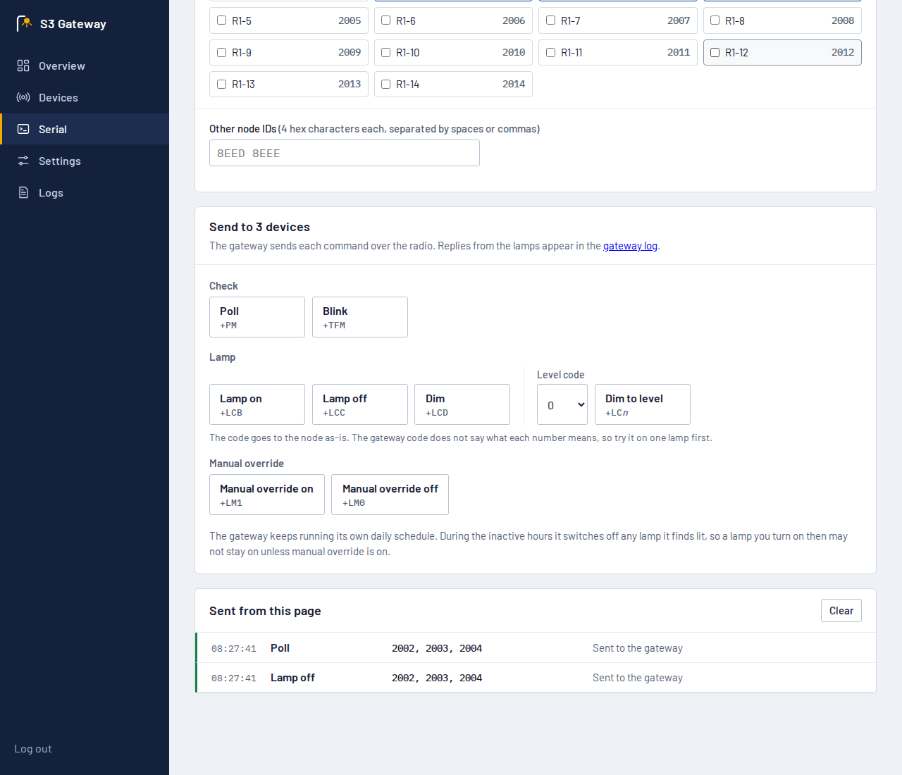

| Button | What it does |
|---|---|
| **Poll** | Asks the light to report in. Use it to check a light is alive. |
| **Blink** | Makes the light flash so you can spot the pole. |
| **Lamp on / Lamp off** | Switches the lamp on or off. |
| **Dim** | Dims the lamp. |
| **Dim to level** | Dims to the level code you pick (0 to 9). What each number means is not documented in the gateway software, so try it on one lamp first. |
| **Manual override on / off** | Takes a light out of (or back into) the gateway's automatic schedule. |

Things to know:

* The page only tells you the **gateway accepted** the request ("Sent to the gateway"). What the light replies appears in the [Logs](#6-logs) page a moment later.
* Switching lamps or overrides for **5 or more** lights asks you to confirm first.
* The gateway keeps running its own daily schedule. In the inactive hours it switches off any lamp it finds lit, so a lamp you switch on then may not stay on unless **Manual override on** is used.
* If you see *The gateway is not answering on its control port*, the gateway service is stopped. Check **Overview**.

### Direct console

For technicians. It works like the `minicom` program: you type a raw command such as `+DS` and read exactly what the gateway's radio answers.

The gateway keeps the USB radio to itself while it runs. To use the console, the website therefore **stops the gateway** and starts it again when you finish. Polling and data collection pause in the meantime.

The console is **switched off** unless it was enabled when the website was installed. If you see "The direct console is turned off", ask whoever installed it, or see [INSTALLATION.md](INSTALLATION.md#turn-on-the-direct-serial-console-optional).

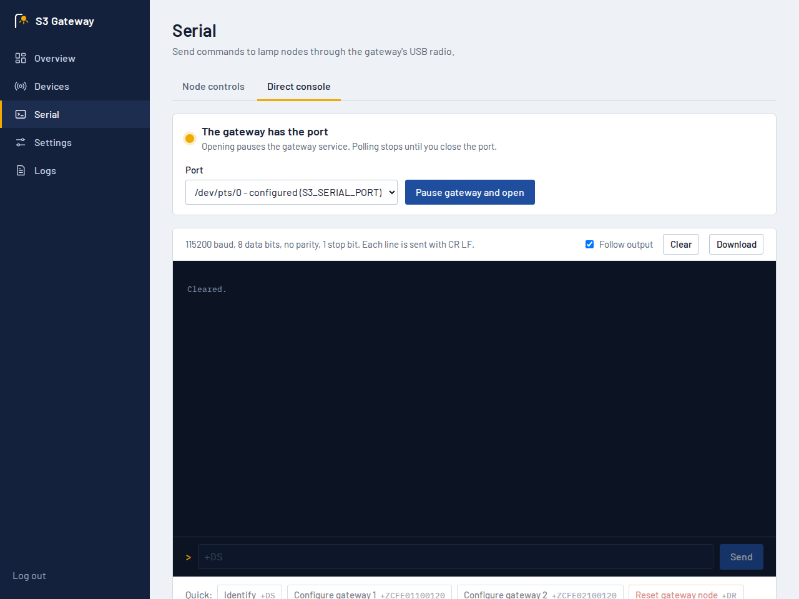

1. Open the **Direct console** tab.
2. Press **Pause gateway and open** and confirm. The status turns green: *Open on /dev/ttyUSB0*.
3. Type a command in the box at the bottom and press **Enter**. Your lines are blue and start with `>`; the gateway's answers start with `<`. The up and down arrow keys bring back earlier commands.
4. When you are done, press **Close**. The gateway starts again by itself.

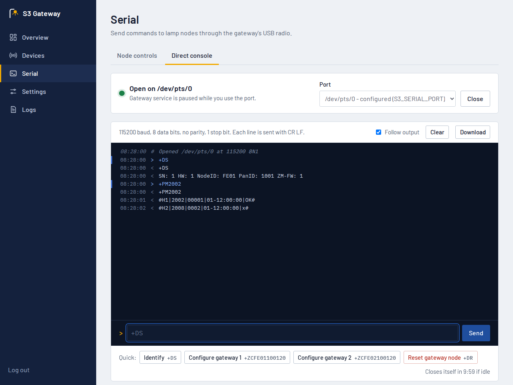

The quick buttons under the box:

| Button | What it does |
|---|---|
| **Identify** `+DS` | Asks the gateway radio who it is (serial number, node ID, PAN ID, firmware). |
| **Configure gateway 1 / 2** | Types the `+ZC` set-up command from your Settings (`first_GW_data` / `second_GW_data`) into the box. Check it, then press Enter. |
| **Reset gateway node** `+DR` | Resets the radio, the same way the gateway does when it finds the radio hung. Asks first. |

Safety nets:

* If nobody uses the console for **10 minutes**, it closes itself and starts the gateway again.
* If the website is restarted while the gateway is paused, it starts the gateway again.
* **Download** saves the lines on screen as a text file for support. **Clear** empties the screen.
* If the website says *The gateway is using the serial port* and you did not choose to pause it, nothing was changed.

---

## 8. Apply your changes

When you are happy with your saved changes:

1. Go to **Overview** (or click **Apply changes** in the yellow bar).
2. Click **Apply changes** and confirm. **The gateway restarts and polling stops for a short time.**
3. Watch the output box. It shows each step as it happens:
   * checking the files
   * backing up PostgreSQL and the current production files
   * installing your node list and configuration
   * synchronising the database
   * restarting the gateway
4. Wait for **Applied successfully.** and `DBUP: PASS`. The **Saved changes** box turns green and shows when it was last applied.


If it says **Apply failed**, read the output box: it explains what was wrong (for example, a bad line in the node list). Your data is safe because the database and files are backed up first. Fix the problem and apply again.

Good to know:

* Only one apply can run at a time.
* You can leave the page while it runs; the apply continues on the gateway.
* If it seems stuck on *"Starting production gateway..."*, see the troubleshooting section of [INSTALLATION.md](INSTALLATION.md).

---

## 9. Using a phone

The website adapts to small screens, so you can check the gateway from a phone while standing at the pole.

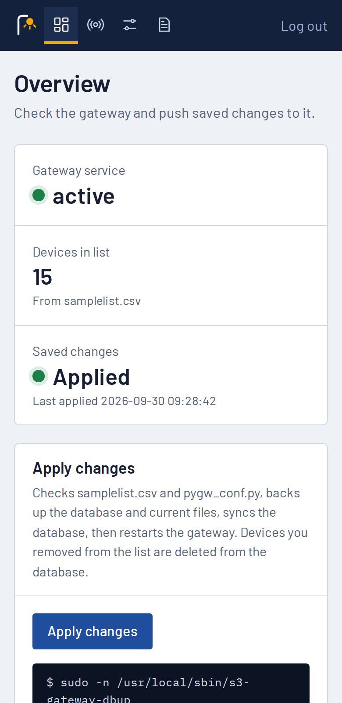

---

## 10. Backups and undoing a mistake

Every save of the node list or settings first copies the previous file to:

```
~/S3Gateway/.webadmin/backups/
```

with the date and time in the name, for example `samplelist-20260930-092539.csv` or `pygw_conf-20260930-092540.py`. The last 30 of each are kept. Apply also backs up PostgreSQL and the production files.

**To go back to an earlier version:**

1. Log in to the gateway (SSH) and copy the backup over the current file:

   ```bash
   cp ~/S3Gateway/.webadmin/backups/samplelist-20260930-092539.csv ~/S3Gateway/samplelist.csv
   ```

2. Open the website and press **Apply changes**.

For the node list you can also use **Download CSV** now and **Replace the whole list from a CSV file** later.

---

## 11. Messages you may see

| Message | Meaning / what to do |
|---|---|
| *Wrong password.* | Check the password. After 5 wrong tries the login locks for 60 seconds. |
| *Invalid or missing CSRF token. Reload the page and try again.* | The page was open too long or you were logged out. Reload it and try again. |
| *Added R2-3 (8EEF). Press Apply...* | Saved. Remember to apply. |
| *duplicate node ID / duplicate pole ID* | That ID is already in the list. Use a different one, or edit the existing row. |
| *node ID must be 4 hex characters* | Use exactly 4 of `0-9` and `A-F`. |
| *Zigbee channel must be 11-26* | Choose a valid Zigbee channel. |
| *Nothing was added. Fix the lines above and resubmit.* | One or more bulk lines were wrong; nothing was saved. Fix them and paste again. |
| *the node list cannot be empty* | You tried to remove the last device. |
| *Upload rejected: CSV header must be exactly...* | The first line of your CSV must be `pole_node,node,pan_id,channel`. |
| *Nothing saved - please fix the highlighted fields.* | A setting has an invalid value. See the red field. |
| *No changes to save.* | You pressed Save without changing anything. |
| *The gateway is not answering on its control port...* | Serial page: the gateway service is stopped (or paused by the direct console). Check Overview, or close the console. |
| *Could not pause the gateway: ... sudo rule* | The direct console was not fully installed. See Installation, "Turn on the direct serial console". |
| *Permission denied on the serial port* | The website's account is not in the `dialout` group. Re-run the installer with the serial option and restart. |
| *An apply is already running.* | Wait for the current apply to finish. |
| *Apply failed (exit code N)* | Read the output box for the reason. Fix it and apply again. |
| *Too many attempts. Try again in Ns.* | Wait for the lockout to end. |
